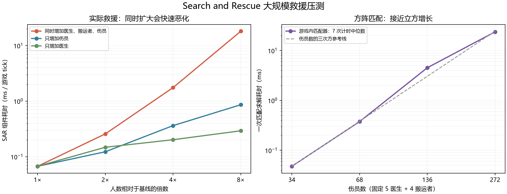

# 大规模救援与人数复杂度检查（2026-09-13）

结论：当前 SAR 在大量医生和大量伤员同时出现时会明显卡顿。固定医生只增加伤员也会变慢，但本轮最严重的是两者共同扩大。单纯缓存患者查询不足以消除这个问题。

## 游戏实测

本机运行 RimWorld 1.6.4871、Harmony、Smart Speed、当前 SAR 开发版。Smart Speed 设置 500 倍目标并忽略事件降速；目标远高于实际性能，因此表中 TPS 为实际吞吐。每档在同一个基础地图存档上重建，串行运行 6,000 tick；统计丢弃第一个约 1,500 tick 窗口，减少初始化影响。场景生成、存档和读档时间不计入。

统一地形为中心区域可通行地面；医生医疗技能 12；伤员有四处同等切伤、35% 失血和麻醉，均标记治疗与救援。病床按人数配置；药品固定为 8 堆、每堆 25，共 200 单位。医生、伤员、床位使用规则排列，每次读回同一个基础地图。医生仍是实际生成的 pawn，特性/身体状态及动态任务不完全相同，不能视为严格恒定的每条边工作量。医学设置沿用 AllTending。

| 医生 | 搬运者 | 伤员 | 实际 TPS | SAR 耗时 μs/tick | SAR 占 tick 耗时 |
| ---: | ---: | ---: | ---: | ---: | ---: |
| 5 | 4 | 34 | 2,063 | 67.2 | 14.5% |
| 10 | 4 | 34 | 1,693 | 148.0 | 26.1% |
| 20 | 4 | 34 | 1,425 | 202.3 | 30.0% |
| 40 | 4 | 34 | 1,043 | 293.0 | 31.9% |
| 5 | 4 | 68 | 1,602 | 122.8 | 20.4% |
| 5 | 4 | 136 | 919 | 362.9 | 34.7% |
| 5 | 4 | 272 | 484 | 862.6 | 43.2% |
| 10 | 8 | 68 | 1,206 | 257.7 | 32.3% |
| 20 | 16 | 136 | 360 | 1,752.8 | 65.0% |
| 40 | 32 | 272 | 49 | 18,146.4 | 89.8% |

基线采用整轮末尾重复的 5/4/34 档，避免冷启动及首档一次 batchmode 的 `Resolution too small (0x0)` UI 错误。表中各档临床记录均为 0 运行错误、0 所有权冲突、0 死亡。6,000 tick 是性能观察窗，不代表救援已经完成，也不能从“0 死亡”推出长期生存率或治疗吞吐达标。这里的 μs/tick 是 SAR 组件计时，含内部探针计时开销，不能当作所有 SAR Harmony 补丁的独立总开销。TPS 是整场游戏实测，没有禁用 SAR 的对照，不能把所有 TPS 差异均归因于 SAR。

最大档的首次窗口约 45 TPS，后续平均约 49 TPS，说明低速不只来自初始化。单次 ScheduleRebuild 峰值 **2,800 ms**；20/16/136 档峰值约 421 ms。大规模既会降 TPS，也会出现明显的单次停顿。

## 人数增长的复杂度

记 W 为进入匹配的工作者数，P 为候选患者数，K=max(W,P)，C 为一组工作者—患者的查询/评分成本。当前一次匹配粗略为：

`O(W × P × C + K³)`，匹配矩阵内存为 `O(K²)`。

依据：WeightedBipartiteMatcher.MaximumWeight 显式计算 W×P 的候选权重，然后把矩阵补成 K×K，使用方阵匈牙利算法。医生很少、伤员很多时，虚拟工作者行仍参与求解，因此少量医生并不能避免 P³ 这一最坏阶数。

在同一个游戏进程内，用当前生产匹配器与预先确定的廉价权重函数进行独立计时，固定 9 名工作者，预热一次后计时 7 次：

| 患者 | 求解中位数 ms | 最小 ms |
| ---: | ---: | ---: |
| 34 | 0.0478 | 0.0468 |
| 68 | 0.3772 | 0.3765 |
| 136 | 4.5363 | 3.0010 |
| 272 | 23.7919 | 23.4135 |

136 档有一定时间波动；初轮独立计时中位数约 3.02 ms。34→272 的患者数增长 8 倍，求解耗时增长约 498 倍，端点指数约 2.99，与三次方增长一致。这是构造权重下的求解基准，不能视为所有实际权重矩阵的固定耗时。

对本轮四档 1×/2×/4×/8× 的实际 SAR μs/tick 做 log-log 直线拟合：只增加伤员约 n^1.26，只增加医生约 n^0.68，同时增加医生、搬运者和伤员约 n^2.70。**这些只是本组动态场景的经验增长率，不是程序的严格时间复杂度或可任意外推的规律。** 更多医生也会更快开始工作、改变剩余候选和触发重建，因此不能只用一个指数概括完整救援过程。

此外，C 不是常数：药物策略、库存来源、患者所有权、寻路等会随地图及模组复杂度变化。例如 MedicalResourceLedger.AvailableInOtherPawnInventories 仍需要枚举地图 pawn 的库存来源。缓存患者紧急程度只降低其中一部分重复查询。

## 最大档的耗时来源

在约 6,017 个观测 tick 内，SAR 组件累计约 112.4 秒：

- 重新调度 520 次，累计约 97.1 秒，平均每次 186.8 ms。基线 80 次，平均每次约 3.61 ms。
- 治疗/捕获匹配阶段约 44.8 秒，其中候选边评分约 32.7 秒（该阶段约 73%）。共评分 365,618 条边。
- 搬运、待命和物资任务匹配阶段约 43.8 秒。
- 治疗监控阶段约 15.8 秒，包含途中重新选择目标等逻辑。

这些计时存在嵌套，不能直接相加。结果说明不仅是方阵求解慢，重新调度频率和候选评分也在放大开销。

建议后续按顺序处理：

1. 采用保留最优匹配的矩形算法，避免大量虚拟行，目标复杂度接近 O(min(W,P)^2 × max(W,P))；需要特别回归同分选择、不可达边及组合任务。
2. 合并同一状态变化引发的重复重建，研究局部重算，保留新急症及时抢占能力。
3. 对同一纯评分阶段建立库存候选来源索引，继续区分“候选列表可以复用”与“剩余数量/预约必须实时验证”；重点优化实际高占比的评分及搬运物资图。

本轮没有更换匹配算法、限制候选数、延长调度间隔或裁剪救援行为。

## 压测发现并修复的防御性检查缺口

初轮的部分场景反复在 PickupReservationAvailable → ForbidUtility.IsForbidden 抛出空引用。PendingAssignmentValid 在检查工作者是否仍有效之前，就尝试原版药品权限查询；原版查询依赖 pawn 的地图/思维状态。

已在待分配任务校验最前面排除 null、已销毁、已离图、不同地图或缺少 mindState 的工作者。之后完整重跑，表中运行没有该异常。退图、销毁和 null 工作者的真实游戏探针检查均通过，普通移动患者治疗回归也通过；现有调度模拟套件通过。初轮有运行异常的性能结果不参与正式表格，只保留在 work/sar-scaling-20260913 供排查。

## 产物与复现

- 探针：Tools/ScalingProbe/Probe.cs，Tools/Run-ScalingProbe.ps1。只放入独立测试 runtime；人数覆盖通过测试 Harmony 前缀实现，生产基准配置未扩大。
- 数据与图：Docs/validation/2026-09-13-scaling，包括完整日志、原始窗口 CSV、11 档临床结果、JSON、PNG/SVG 和回归记录。
- 实际初始存档：D:/Projects/rimworld/work/sar-scaling-20260913-final/Saves；最大场景为 d40p272h32r9_Initial.rws。它们使用独立测试模组 ID，应在对应测试配置下加载。
- 最终 SAR DLL SHA256：B1230A0751355909CF68E0F7A39A020182CD9BE165704033FCE8ABD0E08F46E8。

尚未推送、打 tag 或发布工坊。
